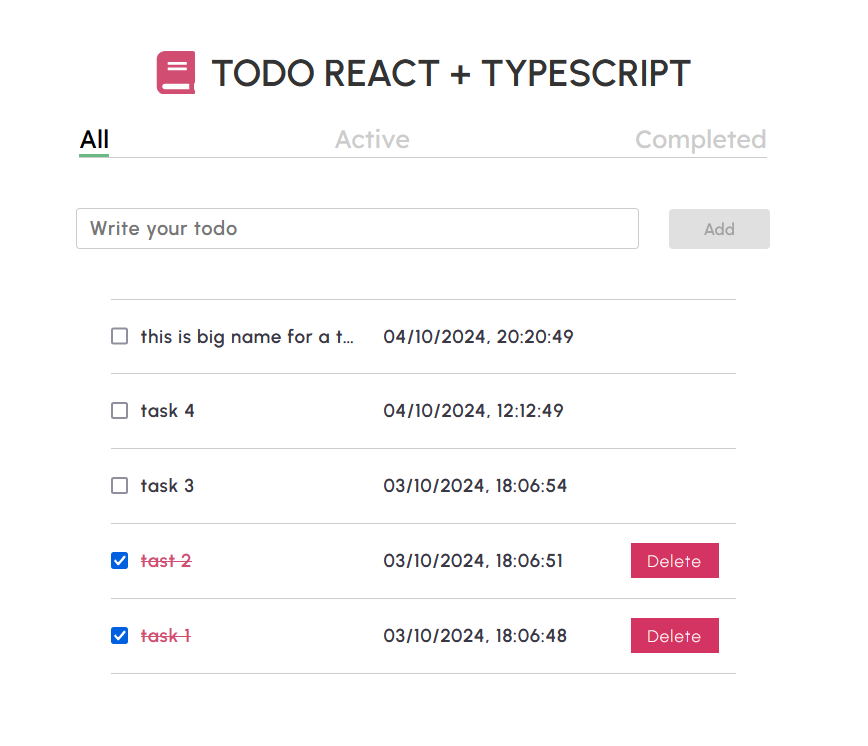

# Todo React + TypeScript

A simple and elegant Todo application built with React and TypeScript. This application allows users to create, manage, and organize their tasks efficiently, with features like filtering tasks by status, marking tasks as completed, and deleting tasks.

This Project is hosted at https://to-do-react-type-script-lemon.vercel.app/

## Demo

## Features

- Add new tasks
- Toggle tasks as completed
- Delete tasks
- Filter tasks by active and completed status
- Display task creation date and time
- Responsive design with user-friendly interface

## Tech Stack

- **Frontend**: React, TypeScript, CSS
- **Icons**: React Icons (for icons)

## Installation

1. Clone the repository
2. Install the dependencies: npm install
3. Start the development server: npm run dev